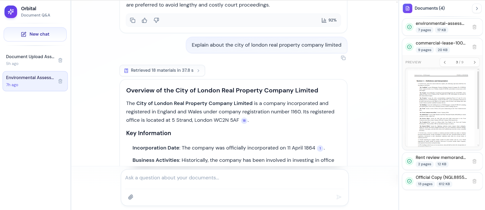
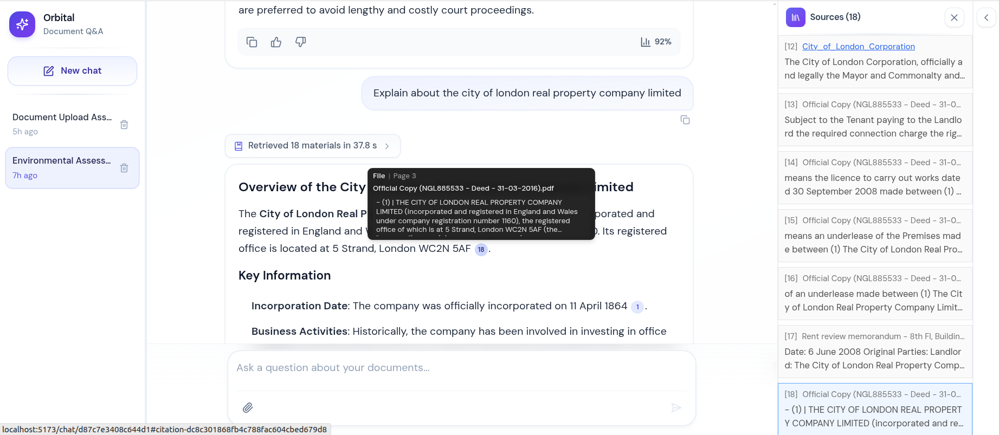
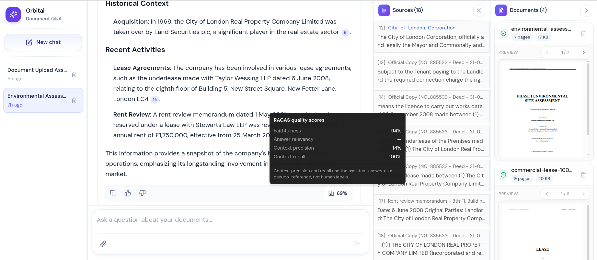
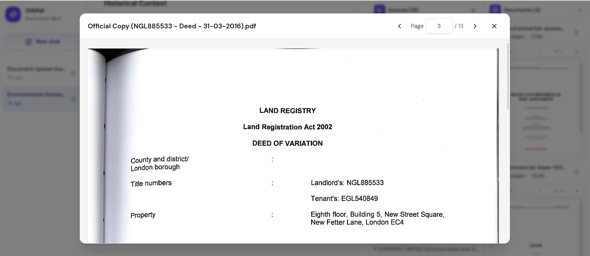

# Orbital — AI Engineering Take-Home

Welcome! This is a take-home assessment for an AI engineering role at Orbital.

You've been given a working baseline application: a document Q&A tool for commercial real estate lawyers. Users upload legal documents (leases, title reports, environmental assessments) and ask questions about them. The AI assistant answers questions grounded in the document content.

The app works, but it has limitations. Your job is to extend it.

## UI Screenshots

#### Screenshot 1


#### Screenshot 2


#### Screenshot 3


#### Screenshot 4


---

## Setup

### Prerequisites
- Docker and Docker Compose
- just (command runner) — install via `brew install just` or `cargo install just`

That's it. Everything else runs inside containers.

### Getting Started

1. Clone this repository

2. Run the setup command:
```
just setup
```
   This copies `.env.example` to `.env` and builds the Docker images.

3. Configure API keys in `.env`:
```
OPENAI_API_KEY=your_key_here
TAVILY_API_KEY=your_key_here
```
   `OPENAI_API_KEY` is required for chat, embeddings, and evaluation.  
   `TAVILY_API_KEY` is used by the web search tool.

4. Start everything:
```
just dev
```
   This starts PostgreSQL, Redis, the Celery worker, the FastAPI backend (port 8000), and the React frontend (port 5173).
   Database migrations run automatically when the backend starts — no separate step needed.

5. Open http://localhost:5173 in your browser.

Your local `backend/src/` and `frontend/src/` directories are mounted into the containers —
edit files normally on your machine and changes hot-reload automatically.

### Sample Documents

We've included two sets of documents:

- `synthetic-docs/` — Programmatically generated legal documents (clean text PDFs). Use these as your primary test case. You can generate more using `scripts/generate-synthetic-docs.py`.
- `real-docs/` — Real-world legal documents including scanned pages and title plans. Use these if you want a harder challenge and visual elments.

### Project Structure

- `frontend/` — React frontend (Vite + Tailwind + shadcn/Radix UI)
- `backend/` — FastAPI backend (Python 3.12 + SQLAlchemy + LangGraph agent runtime)
- `alembic/` — Database migrations
- `synthetic-docs/` — Synthetic legal documents for testing
- `real-docs/` — Real-world legal documents (includes scanned/visual content)
- `APPROACH.md` — architecture write-up, diagrams, trade-offs, and future enhancements

### Current AI Architecture (Implemented)

- **Agent orchestration:** LangGraph ReWOO-style flow (`summarize -> assemble -> classify -> plan -> tools -> solve`).
- **RAG approach:** Corrective RAG loop for document retrieval quality (`retrieve -> grade -> rewrite -> retrieve`).
- **Chunking:** Hybrid chunking strategy (structure-aware + token-aware).
- **Evidence model:** persisted citations with stable `citation_index`, inline citation chips, and sources panel.
- **Evaluation:** async RAGAS scoring per message (`faithfulness`, `answer_relevancy`, `context_precision`, `context_recall`).
- **Streaming UX:** SSE for model tokens + tool/status events, with incremental frontend updates.

### Useful Commands

- `just dev` — Start full stack (Postgres + backend + frontend)
- `just stop` — Stop all services
- `just reset` — Stop everything and clear database
- `just check` — Run all linters and type checks
- `just fmt` — Format all code
- `just db-init` — Run database migrations
- `just db-shell` — Open a psql shell
- `just shell-backend` — Shell into backend container
- `just logs-backend` — Tail backend logs

### Notes

- If RAGAS metrics are pending, frontend now polls per-message endpoint (`/api/messages/{id}/ragas`) instead of refetching the full message list.
- OCR currently uses Tesseract for CPU-friendly local/dev reliability; production direction is GPU-optimized OCR for higher ingestion throughput.
